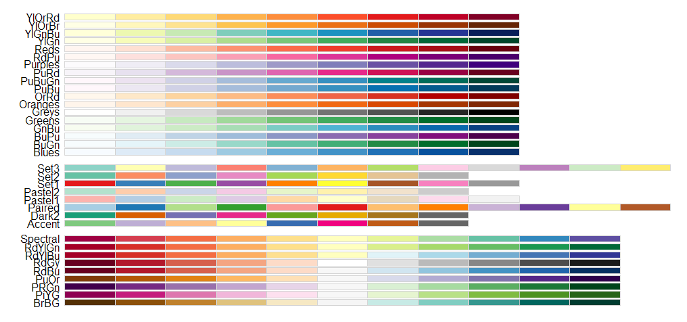

---

# Coordinates

- Cordonnées cartésiennes x-y   
   `coord_cartesian(xlim = ..., ylim = ..., expand = ...)`

--
   
   + `xlim`, `ylim` : contrôle du **zoom**

--
   
   + `expand` (`TRUE`/`FALSE`) : ajout d'espace avant/après les extrêmes

--

- Cordonnées cartésiennes aux proportions fixés   
   `coord_fixed(ratio = ...)`

--

- Cordonnées polaires   
   `coord_polar(theta = 'x', ...)`   
   + `theta` : qui gère l'angle   

--

- Cordonnées inversées   
   `coord_flip()`   
   x devient y


---

# Scales

Correspondance entre les valeurs des **données** et les valeurs dans le **graphique.**

--

Échelles aux valeurs ...

- continues : types `numeric`, `int`, `Date`, ...
- discrètes : tout le reste (`factor`, `char`, ...)

- Noms : `scale_` + esthétique + type d'échelle (`continuous`, `discrete`, `manual`, ...) 

--

#### Anatomie d'une échelle

Toutes échelles acceptent au moins :

- `name` : nom dans la légende

--

- `breaks` : les valeurs seuil où on trouve des droites, des signes, ... (défaut : intelligent)

--

- `labels` : les chaînes de caractères associées aux `breaks` (défaut : intelligent)

--

- `trans` : transformation données → (`breaks`, `labels`) (p.ex. `'log10'`)

--

- `limits` : les valeurs aux extrêmes (`NA` : min/max données)     
  Aussi : fonctions `xlim( )`, `ylim( )`


---

## Scales : x, y

Exemples : 

- `scale_x_continuous(trans = 'log10')` :  
  échelle $x$ logarithmique (`scale_x_log10()`)
- `scale_y_discrete(breaks = c('a', 'b'), labels = c('Premier', 'Deuxième'))` :     
  échelle $y$ discrète
- `scale_y_datetime()` : échelle $y$ pour dates   
  (= `scale_y_continuous(trans = 'date')`)

--

### Scales vs coord\_x\_\* et coord\_y\_\*

<div class="heavy-box center"><span><b>scales</b> les valeurs au delà des limites sont <b>remplacés</b> avec <span class="remark-inline-code">NA</span></span></div>

--

<div class="heavy-box center" style='background: red'><span>⚠ coupure d'éléments graphiques ! ⚠</span></div>


---
class: slide-class-advanced
exclude: true

<!-- TODO -->

### Scales : expansion des limites

- `expand_limits(x = ..., y = ...)` : étendent le graphique jusqu'à ce(s) point(s) là   
  p.ex. `expand_limits(x = 0, y = 0)` pour inclure l'origine
   
--
- `scale_*_*(expand = expand_scale(mult = ..., add = ...))` :   
  pour décider combien d'espace ajouter autour des bords 

---

## Scales : couleurs, remplissage

Fini avec les couleurs de R !   
--

- Échelles chromatiques **optimisées** et **automatiques**   
--

- Pour les esthétiques `col`, `fill`   

--

Continues :

- `scale_color_continuous` : générique
- `scale_color_gradient`, `scale_color_gradient2`, `scale_color_gradientn`
- `scale_color_gray` : valeurs de gris

--

Discrètes :

- `scale_color_brewer` : palettes de [ColorBrewer](http://colorbrewer2.org/) : http://colorbrewer2.org/
  + 3 types : **div**erging, **qual**itative, **seq**uential
  + liste : `RColorBrewer::display.brewer.all()`    


---

- `scale_fill_viridis_d` :    
  même principe mais avec la palette Viridis (Python : `matplotlib`)   
  
 
---
exclude: true

# Scales : exemple

<!-- TODO -->

```{r}

datasets::swiss %>% 
   rownames_to_column('Location') %>% 
   ggplot(aes(x = Catholic, y = Education)) +
   geom_point()

```


---
exclude: true

# Scales : exemple

<!-- TODO -->

Données sur la population US

```{r, eval=FALSE}
economics %>% 
   ggplot(aes(x = date)) + 
   geom_line(aes(y = pop)) + 
   expand_limits(y = 0)

storms %>% 
   mutate(time = paste(year, month, day, hour, sep = '-'),
          time = lubridate::parse_date_time(order = 'ymdH')) %>% 
   ggplot() +
   geom_
   

```
