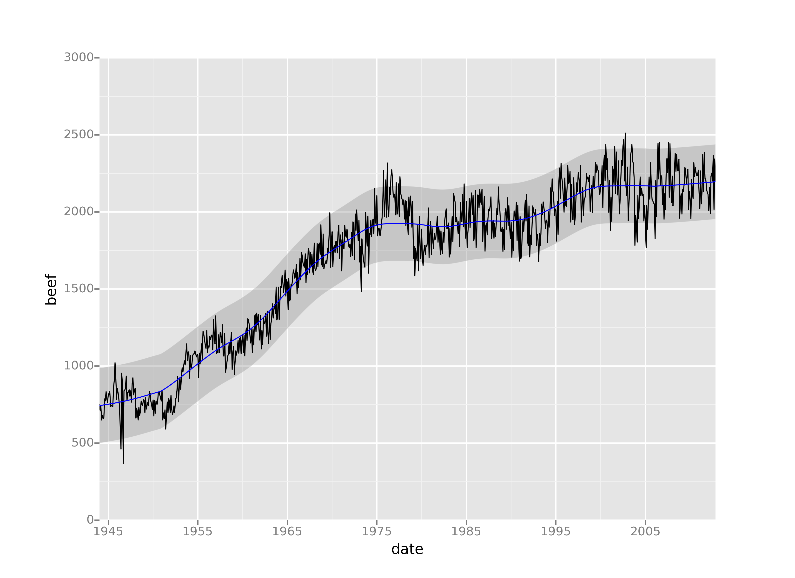

---
class: center, middle, inverse

# Extensions


---
class: slide-class-advanced

# plotly

- Package ![:package_cran plotly] : librarie similaire à `ggplot2`, mais interactive !

--

- traducteur de `ggplot2` à `plotly` : fonction `ggplotly`

--

```{r ggplotly, fig.height=4, eval=FALSE}
library(plotly)

pl <- ggplot(mtcars, aes(x = mpg, y = wt)) + geom_point()

ggplotly(pl) #<<
```

```{r ggplotly-make, eval=TRUE, include=FALSE}
# This chunk is doing the real work!
#
# Only for this presentation
# (xaringan bug on iframes? must include manually)

requireNamespace('htmltools')
library(plotly)

pl <- ggplot(mtcars, aes(x = mpg, y = wt)) + geom_point()


pl_gg <- ggplotly(pl, width=600, height=250)

dir.create(here('widgets'))
htmltools::save_html(pl_gg, file=here("widgets/plotly_figure.html"))
```
<iframe src="widgets/plotly_figure.html" width="600" height="300" scrolling="no" seamless="seamless" frameBorder="0"></iframe>


---
# Animations

Package ![:package_cran gganimate]

Vous ajoutez quelques lignes...

```{r gganimate-code, fig.show=FALSE}
library(ggplot2)
library(gganimate)

p <- ggplot(mtcars, aes(factor(cyl), mpg)) + 
  geom_boxplot() + 
  transition_states( #<<
    gear, transition_length = 2, state_length = 1 #<<
  ) + #<<
  enter_fade() +  #<<
  exit_shrink() + #<<
  ease_aes('sine-in-out') #<<
```


---

# Animations

```{r gganimate-create, include=FALSE, eval=FALSE}
a <- animate(p)
anim_save('assets/img/gganimate.gif', animation = a)

```


---
class: small-code

# Cartographie

Approche à la `tidyverse` : package ![:package_cran sf]

--
```{r sf, fig.height = 4, warning = FALSE}
library(sf)

# Shapefile des cantons
shp <- sf::st_read('data/switzerland_shapefiles/gadm36_CHE_1.shp', quiet = TRUE)

ggplot(shp) +
   geom_sf(aes(fill = (NAME_1 == 'Ticino'))) +
   geom_sf_text(aes(label = NAME_1), size = 3) +
   theme_bw() +
   scale_fill_discrete('', breaks = c(TRUE, FALSE), labels = c('Rigole', 'Travaille'))

```


---
class: small-code slide-class-advanced
exclude: true

# Graphs

- Package ![:package_cran tidygraph]
- Package ![:package_cran ggraph]

- grammaire des **graphs**

<!-- TODO -->

---
class: slide-class-advanced

# ggplot2 in Python

Diverses implémentations de la grammaire des graphiques :
- [`plotnine`](https://plotnine.readthedocs.io/)
- [`ggplot`](http://ggplot.yhathq.com/)

```{python, eval=FALSE}
from ggplot import *

ggplot(aes(x='date', y='beef'), data=meat) +\
    geom_line() +\
    stat_smooth(colour='blue', span=0.2)
```

.img-small-50[
  
]

---
class: center, middle, inverse

# Pour aller plus loin...

---

# Pour aller plus loin...

Galérie des extensions

- [ggplot gallery](https://www.ggplot2-exts.org/gallery/) : https://www.ggplot2-exts.org/gallery/

Protip : 

1. suivez des blog 
2. copiez les exemples de GitHub
3. ???
4. profitez !


---
class: slide-class-advanced

# Ces slides...

## R Markdown

- **Markdown** : langage simple pour rédiger du texte formaté
- GitHub, blogs...

--

- **R Markdown** = Markdown avec code integré
- pour générer 
  + pages web, blogs, articles, présentations, interfaces, livres, ... 
- [Galérie](https://rmarkdown.rstudio.com/gallery.html)
- [Guide](https://bookdown.org/yihui/rmarkdown/) (faite avec R Markdown + ![:package_cran blogdown])

### Cette présentation 

- ![:package_cran xaringan] basé sur la librairie [reveal.js](https://revealjs.com)
- Mélange : R Markdown + CSS (quelques détails)
- [Documentation](http://slides.yihui.name/xaringan/) (c'est une présentation!)


